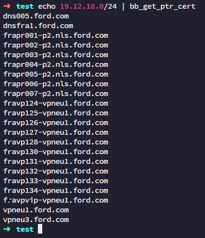

# Custom BB (BugBounty Bash) Functions
This repository contains a collection of custom Bash functions designed to streamline and enhance the bug bounty hunting process. Each function serves a specific purpose, from gathering SSL certificate details to scanning for open ports and extracting subdomain information. By leveraging these functions, bug hunters can automate repetitive tasks, efficiently collect data, and focus more on analysis and exploitation. Explore the functions, adapt them to your workflow, and contribute to the ongoing improvement of this toolkit for the bug bounty community!

## Disclaimer
The functions in this repository are intended for educational and ethical hacking purposes only. Ensure you have permission to test any systems or applications before using these tools. The authors and contributors assume no responsibility for any misuse or illegal activity that may arise from the use of these functions. Always adhere to legal and ethical guidelines in your bug bounty hunting efforts.


## Setup Guide
To effectively utilize the functions provided in this repository, it is crucial to set up your local environment correctly. For this purpose, I highly recommend using an Ubuntu Server 22.04 VPS. This version of Ubuntu is known for its stability, security, and extensive support, making it an ideal choice for running the scripts and tools included in this repository.

1. **Operating System:**  
   This guide assumes you're using **Ubuntu Server 22.04** on a Virtual Private Server (VPS).

2. **Update & Upgrade VPS Packages:**

    ```sh
    sudo apt update && sudo apt upgrade -y
    ```

3. **Root User Preference:**  
   I prefer to operate as the **root** user, so I log into my VPS as root and avoid using `sudo` for installations and operations.

4. **Install Essential Tools:**  
   Install the minimum required tools, as some applications depend on these packages:

    ```sh
    apt install -y git vim curl zsh net-tools tmux make zsh jq unzip postgresql-client crunch gcc python3-apt libssl-dev build-essential libpcap-dev
    ```

5. **Install pip3 (Python Package Manager):**

    ```sh
    curl https://bootstrap.pypa.io/get-pip.py -o get-pip.py
    python3 get-pip.py
    rm get-pip.py
    ```

6. **Install Python Packages:**  
   Install **mmh3** and **poetry** using pip3:

    ```sh
    pip install mmh3 poetry
    ```

7. **Install ZSH & Oh My Zsh:**  
   Since I use **ZSH** with **Oh My Zsh**, let's install **OMZ**:

    ```sh
    sh -c "$(curl -fsSL https://raw.githubusercontent.com/ohmyzsh/ohmyzsh/master/tools/install.sh)"
    ```

8. **Install Sourcegraph CLI (src):**  
   To use **Sourcegraph**, install the `src` CLI:

    ```sh
    curl -s -L https://sourcegraph.com/.api/src-cli/src_linux_amd64 -o /usr/local/bin/src
    chmod +x /usr/local/bin/src
    ```

9. **Install GoLang (Go):**  
   Since most applications I use are developed with **Go**, install the latest version:

    ```sh
    wget https://go.dev/dl/go1.23.1.linux-amd64.tar.gz
    rm -rf /usr/local/go
    tar -C /usr/local -xzf go1.23.1.linux-amd64.tar.gz
    rm go1.23.1.linux-amd64.tar.gz
    ```

    Add Go to the system's path by appending this to your `~/.zshrc`:

    ```sh
    export PATH=$PATH:/usr/local/go/bin
    ```

    Apply changes:

    ```sh
    source ~/.zshrc
    ```

    Verify the installation:

    ```sh
    go version
    ```

10. **Install Go Tools:**  
    Install additional tools using Go:

    ```sh
    go install -v github.com/projectdiscovery/notify/cmd/notify@latest
    go install -v github.com/projectdiscovery/mapcidr/cmd/mapcidr@latest
    go install -v github.com/ffuf/ffuf/v2@latest
    go install -v github.com/tomnomnom/unfurl@latest
    go install -v github.com/projectdiscovery/httpx/cmd/httpx@latest
    go install -v github.com/bp0lr/gauplus@latest
    go install -v github.com/projectdiscovery/katana/cmd/katana@latest
    go install -v github.com/projectdiscovery/subfinder/v2/cmd/subfinder@latest
    go install -v github.com/projectdiscovery/dnsx/cmd/dnsx@latest
    go install -v github.com/projectdiscovery/shuffledns/cmd/shuffledns@latest
    go install -v github.com/tomnomnom/anew@latest
    go install -v github.com/projectdiscovery/nuclei/v3/cmd/nuclei@latest
    go install -v github.com/projectdiscovery/cdncheck/cmd/cdncheck@latest
    go install -v github.com/projectdiscovery/naabu/v2/cmd/naabu@latest
    go install -v github.com/hakluke/hakip2host@latest
    ```

    Add the Go binary path to your `~/.zshrc`:

    ```sh
    export PATH=$PATH:/root/go/bin
    ```

    Apply changes:

    ```sh
    source ~/.zshrc
    ```

11. **Install Other Tools (Massdns, Dnsgen, Altdns, Masscan):**

    ```sh
    mkdir -p /opt/{others,wordlists}
    ```

    Add the `/opt/others` directory to the system path by adding the following to your `~/.zshrc`:

    ```sh
    export PATH=$PATH:/opt/others
    ```

    Apply changes:

    ```sh
    source ~/.zshrc
    ```

    - **Massdns:**

      ```sh
      cd /opt/others
      git clone https://github.com/blechschmidt/massdns.git massdns_dic
      cd massdns_dic
      make
      make install
      mv bin/massdns /opt/others
      rm -rf ../massdns_dic
      ```

    - **Dnsgen:**

      ```sh
      python3 -m pip install dnsgen
      ```

    - **Altdns:**

      ```sh
      pip3 install py-altdns
      ```

    - **Masscan:**

      ```sh
      cd /opt/others
      git clone https://github.com/robertdavidgraham/masscan masscan_dic
      cd masscan_dic
      make
      make install
      mv bin/masscan /opt/others
      rm -rf ../masscan_dic
      ```

12. **Update `~/.zshrc`:**  
    Replace your **~/.zshrc** file with the following content:

    ```sh
    export ZSH="$HOME/.oh-my-zsh"
    ZSH_THEME="robbyrussell"
    plugins=(git)
    source $ZSH/oh-my-zsh.sh

    export PATH=$PATH:/usr/local/go/bin
    export PATH=$PATH:/root/go/bin
    export PATH=$PATH:/opt/others
    ```

13. **Apply `~/.zshrc` Changes:**  
    Save the file and apply the changes:

    ```sh
    source ~/.zshrc
    ```
---

## Custom Bash (ZSH) Functions
One-line summaries for each function:

1. **`bb_get_cert_details`**: Retrieves and displays detailed certificate information for a given domain or list of domains using OpenSSL.

2. **`bb_get_cert_brief`**: Extracts and summarizes issuer, subject, and DNS information from SSL certificates for specified domains.

3. **`bb_get_cert_subdomain`**: Lists unique subdomains found in the DNS fields of SSL certificates for a given domain or list.

4. **`bb_email2domain_viewdns`**: Searches for domains associated with an email address using the ViewDNS service.

5. **`bb_subdomain_dns_rapiddns`**: Fetches and lists unique subdomains for a specified domain using the RapidDNS service.

6. **`bb_cidr_remove_cdn`**: Removes CDN IP addresses from a list of CIDR notations using the `mapcidr` and `cdncheck` tools.

7. **`bb_asn2cidr_details`**: Retrieves and formats details about IPv4 prefixes associated with a specified ASN using the BGPView API.

8. **`bb_asn2cidr`**: Lists all IPv4 prefixes associated with a specified ASN using the BGPView API.

9. **`bb_ipcidr2asn_details`**: Displays ASN details, including IP and registry information, for a specified CIDR block using the Cymru WHOIS service.

10. **`bb_ipcidr2asn`**: Retrieves the ASN for a specified CIDR block using the Cymru WHOIS service.

11. **`bb_ipscan_naabu`**: Scans a specified CIDR for open ports using the `naabu` tool.

12. **`bb_ipscan_masscan`**: Scans a specified CIDR for open ports using the `masscan` tool.

13. **`bb_get_ptr`**: Retrieves and lists PTR records for a given IP address or list of IPs.

14. **`bb_get_ptr_cert`**: Fetches PTR records linked to IP addresses and filters results to show associated certificates.

15. **`bb_crtsh_subdomain`**: Queries the crt.sh database to retrieve unique subdomains associated with a specified domain.

16. **`bb_abuseipdb_subdomain`**: Extracts potential subdomains for an IP address using the AbuseIPDB service.

17. **`bb_chaos_search`**: Searches for URLs related to a specified keyword from the Chaos Data repository.

18. **`bb_chaos_download`**: Downloads and extracts data from URLs associated with a specified keyword from the Chaos Data repository.

19. **`bb_github_subdomain`**: Searches for subdomains related to a specified domain using the Sourcegraph search API.

20. **`bb_wlgen_assetnote`**: Merges and generates a unique wordlist of DNS and subdomain entries from Assetnote.

21. **`bb_wlgen_4char`**: Generates a wordlist of all combinations of 1 to 4 characters using `crunch`.

22. **`bb_wlgen_chaos`**: Creates a unique wordlist from subdomains found in the Chaos Data repository.

23. **`bb_wlgen_dynamic`**: Merges and generates a dynamic wordlist from specified DNS-related files hosted on GitHub.

24. **`bb_dns_static`**: Resolves DNS records for a specified domain or list of domains and outputs the results.

25. **`bb_dns_dynamic_dnsgen`**: Generates dynamic DNS records using `dnsgen` and resolves them for a specified domain.

26. **`bb_dns_dynamic_altdns`**: Generates potential subdomains using `altdns`, resolves them, and outputs the results.

27. **`bb_livesubs_httpx`**: Performs HTTP requests to gather status and technical details for specified URLs using `httpx`.

## Function Details

### 1. **`bb_get_cert_details`**  
The `bb_get_cert_details` function retrieves and displays SSL/TLS certificate details for a specified domain or multiple domains read from standard input using `openssl`. It outputs the certificate information in a human-readable format while suppressing error messages.

```sh
bb_get_cert_details() {
    if [[ $# -eq 1 ]]; then
        input="$1"
        echo | openssl s_client -showcerts -servername "$input" -connect "$input" 2>/dev/null | openssl x509 -inform pem -noout -text 2> /dev/null
    else
        while read -r input; do
            echo | openssl s_client -showcerts -servername "$input" -connect "$input" 2>/dev/null | openssl x509 -inform pem -noout -text 2> /dev/null
        done
    fi
}
```

| Syntax                                  | Description            |
|------------------------------------------|------------------------|
| `echo IP:443 \| bb_get_cert_details`     | Input via stdin        |
| `bb_get_cert_details IP:443`            | Argument input         |
| `cat ips.txt \| bb_get_cert_details`     | File input             |

<details>
<summary>Click to expand/collapse image</summary>


</details>

---

### 2. **`bb_get_cert_brief`**  
The `bb_get_cert_brief` function retrieves a brief summary of SSL/TLS certificate details for a specified domain or multiple domains read from standard input, focusing on the issuer, subject, and DNS names. It filters the output to present only relevant information in a concise format while suppressing error messages.

```sh
bb_get_cert_brief() {
    if [[ $# -eq 1 ]]; then
        input="$1"
        echo | openssl s_client -showcerts -servername "$input" -connect "$input" 2>/dev/null | openssl x509 -inform pem -noout -text \
        | grep -E "(Issuer|Subject:|DNS:)" | grep -vE "(Issuers)" | sed "s/ //g"
    else
        while read -r input; do
            echo | openssl s_client -showcerts -servername "$input" -connect "$input" 2>/dev/null | openssl x509 -inform pem -noout -text \
            | grep -E "(Issuer|Subject:|DNS:)" | grep -vE "(Issuers)" | sed "s/ //g"
        done
    fi
}
```

| Syntax                                  | Description            |
|------------------------------------------|------------------------|
| `echo IP:443 \| bb_get_cert_brief`       | Input via stdin        |
| `bb_get_cert_brief IP:443`              | Argument input         |
| `cat ips.txt \| bb_get_cert_brief`       | File input             |

<details>
<summary>Click to expand/collapse image</summary>


</details>

---

### 3. **`bb_get_cert_subdomain`**  
The `bb_get_cert_subdomain` function extracts and lists unique subdomains from the SSL/TLS certificate of a specified domain or multiple domains read from standard input. It filters the output to display only the DNS entries, removes unnecessary text, and ensures that the results are sorted and unique, while suppressing error messages.

```sh
bb_get_cert_subdomain() {
    if [[ $# -eq 1 ]]; then
        input="$1"
        echo | openssl s_client -showcerts -servername "$input" -connect "$input" 2>/dev/null | openssl x509 -inform pem -noout -text 2> /dev/null \
        | grep "DNS:" | grep -v "Issuers" | sed "s/ //g" | sed "s/,/\n/g" | tr -d "DNS:" | sed "s/*.//g" | sort -u
    else
        rm -rf .tmp
        while read -r input; do
            echo | openssl s_client -showcerts -servername "$input" -connect "$input" 2>/dev/null | openssl x509 -inform pem -noout -text 2> /dev/null \
            | grep "DNS:" | grep -v "Issuers" | sed "s/ //g" | sed "s/,/\n/g" | tr -d "DNS:" | sed "s/*.//g" >> .tmp
        done
        cat .tmp | sort -u; rm -rf .tmp
    fi
}
```

| Syntax                                  | Description            |
|------------------------------------------|------------------------|
| `echo IP:443 \| bb_get_cert_subdomain`   | Input via stdin        |
| `bb_get_cert_subdomain IP:443`          | Argument input         |
| `cat ips.txt \| bb_get_cert_subdomain`   | File input             |

<details>
<summary>Click to expand/collapse image</summary>


</details>

---

### 4. **`bb_email2domain_viewdns`**  
The `bb_email2domain_viewdns` function retrieves unique domain names associated with a given email address from the ViewDNS Reverse Whois service. It accepts a single email address or multiple addresses from standard input, using `curl` to fetch data while setting specific headers for cookies and user agents, then processes the HTML response to extract and display the relevant domain names in a sorted, unique list.

```sh
bb_email2domain_viewdns() {
    cf_clearance="<INSERT_COOKIE>"
    useragent="Mozilla/5.0 (Windows NT 10.0; Win64; x64) AppleWebKit/537.36 (KHTML, like Gecko) Chrome/128.0.0.0 Safari/537.36"
    if [[ $# -eq 1 ]]; then
        input="$1"
        curl "https://viewdns.info/reversewhois/?q=$input" -H "cookie: cf_clearance=$cf_clearance" -H "user-agent: $useragent" 2> /dev/null \
        | grep -oE "<tr>(.+)</tr>" | sed -E "s_(<tr>|</tr>)_\n_g" | grep -E "^(<td>\w+)" | grep -v "Domain Name" | cut -d ">" -f 2 | cut -d "<" -f 1 | sort -u
    else
        rm -rf .tmp
        while read -r input; do
            curl "https://viewdns.info/reversewhois/?q=$input" -H "cookie: cf_clearance=$cf_clearance" -H "user-agent: $useragent" 2> /dev/null \
            | grep -oE "<tr>(.+)</tr>" | sed -E "s_(<tr>|</tr>)_\n_g" | grep -E "^(<td>\w+)" | grep -v "Domain Name" | cut -d ">" -f 2 | cut -d "<" -f 1 >> .tmp
        done
        cat .tmp | sort -u; rm -rf .tmp
    fi
}
```

| Syntax                                  | Description            |
|------------------------------------------|------------------------|
| `echo email \| bb_email2domain_viewdns`  | Input via stdin        |
| `bb_email2domain_viewdns email`         | Argument input         |
| `cat emails.txt \| bb_email2domain_viewdns` | File input         |

<details>
<summary>Click to expand/collapse image</summary>


</details>

---

### 5. **`bb_subdomain_dns_rapiddns`**  
The `bb_subdomain_dns_rapiddns` function fetches and lists unique subdomains for a specified domain using the RapidDNS service. It accepts either a single domain as an argument or multiple domains from standard input, utilizing `curl` to retrieve the data and filtering the results to include only subdomains that match the input domain, while ensuring the output is sorted and unique.

```sh
bb_subdomain_dns_rapiddns() {
    if [[ $# -eq 1 ]]; then
        input="$1"
        curl -s "https://rapiddns.io/subdomain/$input?full=1" | grep -Eo '[a-zA-Z0-9.-]+\.[a-zA-Z]{2,}' | grep "$input" | sort -u
    else
        while read -r input; do
            curl -s "https://rapiddns.io/subdomain/$input?full=1" | grep -Eo '[a-zA-Z0-9.-]+\.[a-zA-Z]{2,}' | grep "$input" | sort -u
        done
    fi
}
```

| Syntax                                   | Description            |
|-------------------------------------------|------------------------|
| `bb_subdomain_dns_rapiddns tesla.com`     | Argument input         |
| `echo tesla.com \| bb_subdomain_dns_rapiddns` | Input via stdin    |

<details>
<summary>Click to expand/collapse image</summary>


</details>

---

### 6. **`bb_cidr_remove_cdn`**
The `bb_cidr_remove_cdn` function processes CIDR notation input to identify and remove IP ranges associated with Content Delivery Networks (CDNs). It accepts input either from a file (if a valid filename is provided) or directly from standard input, using `mapcidr` to handle the CIDR ranges and `cdncheck` to filter out the CDN-associated addresses, both in silent mode to suppress unnecessary output.

```sh
bb_cidr_remove_cdn() {
    input=$(cat)
    if [[ -f "$input" ]]; then
        cat "$input" | mapcidr -silent | cdncheck -silent -e
    else
        echo "$input" | mapcidr -silent | cdncheck -silent -e
    fi
}
```

| Syntax | Description |
|-------------------------------------------|------------------------|
| `echo 135.181.255.10 \| bb_cidr_remove_cdn` | STDIN, Single IP |
| `echo 135.181.255.0/30 \| bb_cidr_remove_cdn` | STDIN, CIDR |
| `cat cidr.txt \| bb_cidr_remove_cdn` | File including Single IP and CIDR |

<details>
<summary>Click to expand/collapse image</summary>


</details>

---

### 7. **`bb_asn2cidr_details`**
The `bb_asn2cidr_details` function retrieves and displays detailed information about IPv4 prefixes associated with a specified Autonomous System Number (ASN). It accepts either a single ASN as an argument or multiple ASNs from standard input, using `curl` to fetch data from the BGPView API and `jq` to parse the JSON response, formatting the output to show the prefix, name, description (or "N/A" if not available), and country code in a structured table.

```sh
bb_asn2cidr_details() {
    if [[ $# -eq 1 ]]; then
        input="$1"
        curl -s "https://api.bgpview.io/asn/$input/prefixes" \
        | jq -r '["Prefix", "Name", "Description", "Country Code"], (.data.ipv4_prefixes[] | [.prefix, .name, (.description // "N/A"), .country_code]) | @tsv' 2> /dev/null \
        | awk -F'\t' '{printf "%-24s %-40s %-50s %s\n", $1, $2, $3, $4}'
    else
        printf "%-24s %-40s %-50s %s\n" "Prefix" "Name" "Description" "Country Code"
        while read -r input; do
            curl -s "https://api.bgpview.io/asn/$input/prefixes" \
            | jq -r '(.data.ipv4_prefixes[] | [.prefix, .name, (.description // "N/A"), .country_code]) | @tsv' 2> /dev/null \
            | awk -F'\t' '{printf "%-24s %-40s %-50s %s\n", $1, $2, $3, $4}'
        done
    fi
}
```

| Syntax                                   | Description            |
|-------------------------------------------|------------------------|
| `echo AS12348 \| bb_asn2cidr_details` | STDIN, Single ASN (With AS Prefix) |
| `echo 12348 \| bb_asn2cidr_details` | STDIN, Single ASN (With AS Prefix) |
| `cat ASNs.txt \| bb_asn2cidr_details` | File including Multiple ASN |

<details>
<summary>Click to expand/collapse image</summary>


</details>

---

### 8. **`bb_asn2cidr`**
The `bb_asn2cidr` function retrieves and lists the IPv4 prefixes associated with a specified Autonomous System Number (ASN). It accepts either a single ASN as an argument or multiple ASNs from standard input, using `curl` to fetch data from the BGPView API and `jq` to extract the prefixes, suppressing any error output.

```sh
bb_asn2cidr() {
    if [[ $# -eq 1 ]]; then
        input="$1"
        curl -s "https://api.bgpview.io/asn/$input/prefixes" | jq -r ".data.ipv4_prefixes[].prefix" 2> /dedv/null
    else
        while read -r input; do
            curl -s "https://api.bgpview.io/asn/$input/prefixes" | jq -r ".data.ipv4_prefixes[].prefix" 2> /dedv/null
        done
    fi
}
```

| Syntax                                   | Description            |
|-------------------------------------------|------------------------|
| `echo AS12348 \| bb_asn2cidr` | STDIN, Single ASN (With AS Prefix) |
| `echo 12348 \| bb_asn2cidr` | STDIN, Single ASN (With AS Prefix) |
| `cat ASNs.txt \| bb_asn2cidr` | File including Multiple ASN |

<details>
<summary>Click to expand/collapse image</summary>


</details>

---

### 9. **`bb_ipcidr2asn_details`**
The `bb_ipcidr2asn_details` function retrieves and displays detailed information about the Autonomous System Number (ASN) associated with a specified IP address or CIDR range. It formats the output to show the ASN, IP, BGP prefix, country code (CC), registry, allocation status, and AS name in a structured table. The function accepts either a single IP/CIDR as an argument or reads from standard input, using the Whois service from Cymru for data retrieval and filtering out unnecessary warnings and header lines.

```sh
bb_ipcidr2asn_details() {
    printf "%-7s | %-16s | %-19s | %-2s | %-8s | %-10s | %-20s\n" "ASN" "IP" "BGP Prefix" "CC" "Registry" "Allocated" "AS Name"
    if [[ $# -eq 1 ]]; then
        input="$1"
        whois -h whois.cymru.com -v $input | grep -vE "Warning| BGP Prefix"
    else
        input=$(cat);
        whois -h whois.cymru.com -v $input | grep -vE "Warning| BGP Prefix"
    fi
}
```

| Syntax                                   | Description            |
|-------------------------------------------|------------------------|
| `echo 157.240.2.20 \| bb_ipcidr2asn_details` | STDIN, Single IP |
| `bb_ipcidr2asn_details 157.240.2.20` | Argument, Single IP |
| `cat ips.txt \| bb_ipcidr2asn_details` | File including Multiple IP address |
| `cat mix.txt \| bb_ipcidr2asn_details` | File including IPs and CIDR |

<details>
<summary>Click to expand/collapse image</summary>


</details>

---

### 10. **`bb_ipcidr2asn`**
The `bb_ipcidr2asn` function retrieves the Autonomous System Number (ASN) for a specified IP address or CIDR range. It accepts either a single input as an argument or multiple inputs from standard input, using the Whois service from Cymru to fetch data. The output is filtered to exclude warnings and headers, returning only the ASN, and for multiple inputs, the results are sorted and displayed uniquely.

```sh
bb_ipcidr2asn() {
    if [[ $# -eq 1 ]]; then
        input="$1"
        whois -h whois.cymru.com -v $input | grep -vE "Warning| BGP Prefix" | cut -d " " -f 1
    else
        while read -r input; do
            whois -h whois.cymru.com -v $input | grep -vE "Warning| BGP Prefix" | cut -d " " -f 1 >> .tmp
        done
        cat .tmp | sort -u; rm -rf .tmp
    fi
}
```

| Syntax                                   | Description            |
|-------------------------------------------|------------------------|
| `echo 157.240.2.20 \| bb_ipcidr2asn` | STDIN, Single IP |
| `bb_ipcidr2asn 157.240.2.20` | Argument, Single IP |
| `cat ips.txt \| bb_ipcidr2asn` | File including Multiple IP address |
| `cat cidrs.txt \| bb_ipcidr2asn` | File including Multiple CIDRs |
| `cat mix.txt \| bb_ipcidr2asn` | File including IPs and CIDR |

<details>
<summary>Click to expand/collapse image</summary>


</details>

---

### 11. **`bb_ipscan_naabu`**
The `bb_ipscan_naabu` function performs a port scan on specified IP addresses or CIDR ranges using the `naabu` tool. It accepts a single IP/CIDR as an argument or reads from a file or standard input. The function utilizes `mapcidr` to convert CIDR notation into individual IP addresses and scans for a predefined list of ports (such as 80, 443, and others) while suppressing output verbosity.

```sh
bb_ipscan_naabu(){
    $ports="80,8000,8080,8880,2052,2082,2086,2095,443,2053,2083,2087,2096,8443,10443"
    if [[ $# -eq 1 ]]; then
        input="$1"
        echo $input | mapcidr -silent | naabu -p "$ports" -silent
    else
        input=$(cat)
        if [[ -f "$input" ]]; then
            cat "$input" | mapcidr -silent | naabu -p "$ports" -silent
        else
            echo "$input" | mapcidr -silent | naabu -p "$ports" -silent
        fi
    fi
}
```

| Syntax                                   | Description            |
|-------------------------------------------|------------------------|
| `echo 103.49.13.0/29 \| bb_ipscan_naabu` | STDIN, CIDR or Single IP |
| `bb_ipscan_naabu 103.49.13.0/29` | Argument, CIDR or Single IP |
| `cat cidrs.txtt \| bb_ipscan_naabu` | File including Multiple CIDRs |
| `cat cidrs.txt \| bb_ipscan_naabu \| bb_get_cert_subdomain` | Extracted Subdomains from SSL certifications |

<details>
<summary>Click to expand/collapse image</summary>


</details>

---

### 12. **`bb_ipscan_masscan`**
The `bb_ipscan_masscan` function performs a port scan on specified IP addresses or CIDR ranges using the `masscan` tool. It accepts a single IP/CIDR as an argument or reads from a file or standard input. The function scans for a predefined set of ports (like 80, 443, etc.) and outputs the open ports in the format "IP:port" while suppressing error messages for cleaner output.

```sh
bb_ipscan_masscan(){
    ports="80,8000,8080,8880,2052,2082,2086,2095,443,2053,2083,2087,2096,8443,10443"
    if [[ $# -eq 1 ]]; then
        input="$1"
        masscan $input --open --ports "$ports" 2> /dev/null | grep "open" | awk '{print $6 ":" $4}' | cut -d "/" -f 1
    else
        input=$(cat)
        if [[ -f "$input" ]]; then
            masscan $input --open --ports "$ports" 2> /dev/null | grep "open" | awk '{print $6 ":" $4}' | cut -d "/" -f 1   
        else
            masscan $input --open --ports "$ports" 2> /dev/null | grep "open" | awk '{print $6 ":" $4}' | cut -d "/" -f 1
        fi
    fi
}
```

| Syntax                                   | Description            |
|-------------------------------------------|------------------------|
| `echo 103.49.13.0/29 \| bb_ipscan_masscan` | STDIN, CIDR or Single IP |
| `bb_ipscan_masscan 103.49.13.0/29` | Argument, CIDR or Single IP |
| `cat cidrs.txtt \| bb_ipscan_masscan` | File including Multiple CIDRs |
| `cat cidrs.txt \| bb_ipscan_masscan \| bb_get_cert_subdomain` | Extracted Subdomains from SSL certifications |

<details>
<summary>Click to expand/collapse image</summary>


</details>

---
### 13. **`bb_get_ptr`**
The `bb_get_ptr` function retrieves the PTR (pointer) records for specified IP addresses or CIDR ranges. It accepts either a single IP/CIDR as an argument or reads from a file or standard input. The function uses `mapcidr` to convert CIDR notation into individual IP addresses and then queries for PTR records with `dnsx`, sorting and displaying the unique results.

```sh
bb_get_ptr(){
    if [[ $# -eq 1 ]]; then
        input="$1"
        echo $input | mapcidr -silent | dnsx -silent -resp-only -ptr | sort -u 
    else
        input=$(cat)
        if [[ -f "$input" ]]; then
            cat $input | mapcidr -silent | dnsx -silent -resp-only -ptr | sort -u
        else
            echo $input | mapcidr -silent | dnsx -silent -resp-only -ptr | sort -u		
        fi
    fi
}
```

| Syntax                                   | Description            |
|-------------------------------------------|------------------------|
| `echo 19.12.18.0/24 \| bb_get_ptr` | STDIN, CIDR or Single IP |
| `bb_get_ptr 19.12.18.0/24` | Argument, CIDR or Single IP |
| `cat cidrs.txt \| bb_get_ptr` | File including Multiple CIDRs |

<details>
<summary>Click to expand/collapse image</summary>


</details>

---
### 14. **`bb_get_ptr_cert`**
The `bb_get_ptr_cert` function retrieves unique hostnames associated with the PTR records for specified IP addresses or CIDR ranges. It accepts either a single IP/CIDR as an argument or reads from a file or standard input. The function uses `mapcidr` to convert CIDR notation into individual IP addresses and then applies `hakip2host` to extract the hostnames, sorting and displaying the unique results.

```sh
bb_get_ptr_cert(){
    if [[ $# -eq 1 ]]; then
        input="$1"
        echo $input | mapcidr -silent | hakip2host | cut -d " " -f 3 | sort -u
    else
        input=$(cat)
        if [[ -f "$input" ]]; then
            cat $input | mapcidr -silent | hakip2host | cut -d " " -f 3 | sort -u
        else
            echo $input | mapcidr -silent | hakip2host | cut -d " " -f 3 | sort -u
        fi
    fi
}
```

| Syntax                                   | Description            |
|-------------------------------------------|------------------------|
| `echo 19.12.18.0/24 \| bb_get_ptr_cert` | STDIN, CIDR or Single IP |
| `bb_get_ptr_cert 19.12.18.0/24` | Argument, CIDR or Single IP |
| `cat cidrs.txt \| bb_get_ptr_cert` | File including Multiple CIDRs |

<details>
<summary>Click to expand/collapse image</summary>


</details>

---
### 15. **`bb_crtsh_subdomain`**
The `bb_crtsh_subdomain` function queries the crt.sh database to retrieve unique subdomains associated with a specified domain from certificate data. It accepts a domain as an argument or reads it from standard input if not provided. The function constructs a SQL query, executes it against the crt.sh database using `psql`, and processes the results to filter, clean, and sort the subdomains in lowercase, displaying unique entries. If the query fails, it outputs an error message.

```sh
bb_crtsh_subdomain() {
    if [ -z "$1" ]; then read -r domain; else domain="$1"; fi
    query=$(cat <<-END
        SELECT ci.NAME_VALUE FROM certificate_and_identities ci WHERE plainto_tsquery('certwatch', '$domain') @@ identities(ci.CERTIFICATE)
END
)
    result=$(echo "$query" | psql -t -h crt.sh -p 5432 -U guest certwatch 2>/dev/null)
    if [ $? -eq 0 ]; then
        echo "$result" | sed 's/ //g' | egrep ".*.\.$domain" | sed 's/*\.//g' | tr '[:upper:]' '[:lower:]' | sort -u
    else
        echo "Failed to execute query or connect to the crt.sh database."
    fi
}
```

| Syntax                                   | Description            |
|-------------------------------------------|------------------------|
| `echo tesla.com \| bb_crtsh_subdomain` | STDIN, Domain |
| `bb_crtsh_subdomain tesla.com` | Argument, Domain |
| `cat domains.txt \| bb_crtsh_subdomain` | File including Multiple Domains |

<details>
<summary>Click to expand/collapse image</summary>


</details>

---
### 16. **`bb_abuseipdb_subdomain`**
The `bb_abuseipdb_subdomain` function retrieves potential subdomains associated with an IP address from the AbuseIPDB website. It accepts an IP address as an argument or reads from standard input if not provided. The function uses `curl` to fetch the data while including a session cookie and user agent for access, then processes the HTML response to extract and format subdomain entries. After execution, it cleans up the session variables.

```sh
bb_abuseipdb_subdomain(){
    abuseIPDB_cookie="cookie: abuseipdb_session=<INSERT YOUR COOKIE HERE>"
    abuseIPDB_user_agent="user-agent: Mozilla/5.0 (Windows NT 10.0; Win64; x64) AppleWebKit/537.36 (KHTML, like Gecko) Chrome/127.0.0.0 Safari/537.36"
    if [[ $# -eq 1 ]]; then input="$1"; else input=$(cat); fi
    curl -s "https://www.abuseipdb.com/whois/$input" -H "$abuseIPDB_cookie" -H "$abuseIPDB_user_agent" | grep -E '<li>\w.*</li>' | sed -E 's/<\/?li>//g' | sed -e "s/$/.$input/"
    unset abuseIPDB_cookie; unset abuseIPDB_user_agent
}
```

| Syntax                                   | Description            |
|-------------------------------------------|------------------------|
| `echo tesla.com \| bb_abuseipdb_subdomain` | STDIN, Domain |
| `bb_abuseipdb_subdomain tesla.com` | Argument, Domain |

<details>
<summary>Click to expand/collapse image</summary>


</details>

---
### 17. **`bb_chaos_search`**
The `bb_chaos_search` function searches for URLs related to a specified input from the Chaos Data repository. It accepts a single keyword as an argument or reads from standard input if no argument is provided. The function fetches the index data from the Chaos Data API using `curl`, processes the JSON response with `jq` to extract URLs, and filters the results to display only those matching the input.

```sh
bb_chaos_search() {
    if [[ $# -eq 1 ]]; then input="$1"; else input=$(cat); fi
    curl -s "https://chaos-data.projectdiscovery.io/index.json" | jq ".[].URL" --raw-output | grep $input
}
```

| Syntax                                   | Description            |
|-------------------------------------------|------------------------|
| `echo tesla \| bb_chaos_search` | STDIN, Company name |
| `bb_chaos_search tesla` | Argument, Company name |
| `cat programs.txt \| bb_chaos_search` | STDIN, A file contains companies name |
| `echo "-e \*.\*" \| bb_chaos_search` | STDIN, Search for all programs |

<details>
<summary>Click to expand/collapse image</summary>


</details>

---
### 18. **`bb_chaos_download`**
The `bb_chaos_download` function downloads and extracts data from URLs related to a specified input from the Chaos Data repository. It creates a temporary directory called `chaos`, retrieves the index data using `curl`, and filters for URLs matching the input. The function then uses `wget` to download each link and extracts the contents of any ZIP files in the directory. Finally, it cleans up by removing the ZIP files and temporary files before returning to the original directory.

```sh
bb_chaos_download() {
    rm -rf chaos; mkdir -p chaos; cd chaos
    if [[ $# -eq 1 ]]; then input="$1"; else input=$(cat); fi
    curl -s "https://chaos-data.projectdiscovery.io/index.json" | jq ".[].URL" --raw-output | grep $input > .tmp
    for link in $(cat .tmp); do wget -nv "$link"; done
    for file in $(ls); do unzip -qq $file 2> /dev/null; done; rm -rf *.zip; rm -rf .tmp; cd - 2> /dev/null
}
```

| Syntax                                   | Description            |
|-------------------------------------------|------------------------|
| `echo tesla \| bb_chaos_download` | STDIN, Company name |
| `bb_chaos_download tesla` | Argument, Company name |
| `cat programs.txt \| bb_chaos_download` | STDIN, A file contains companies name |
| `echo "-e \*.\*" \| bb_chaos_download` | STDIN, All subdomains for all companies |

<details>
<summary>Click to expand/collapse image</summary>


</details>

---
### 19. **`bb_github_subdomain`**
The `bb_github_subdomain` function searches for subdomains associated with a specified domain using the Sourcegraph search API. It accepts a domain as an argument or reads from standard input if no argument is provided. The function constructs a search query to look for subdomains in repositories, retrieves the results in JSON format, and processes them with `jq` to extract relevant matches. It then formats the output to show unique subdomains in lowercase. After execution, it cleans up the environment variables used for the search.

```sh
bb_github_subdomain(){
    export SRC_ENDPOINT=https://sourcegraph.com
    export SRC_ACCESS_TOKEN=<INSERT-SRC-ACCESS-TOKEN-HERE>
    if [[ $# -eq 1 ]]; then input="$1"; else input=$(cat); fi
    q=$(echo $input | sed -e 's/\./\\\./g')
    src search -json '([a-z\-]+)?:?(\/\/)?([a-zA-Z0-9]+[.])+('${q}') count:5000 fork=yes archive:yes' \
    | jq -r '.Results[] | .lineMatches[].preview, .file.path' | grep -oiE '([a-zA-Z0-9]+[.])+('${q}')' | awk '{print to lower($0)}' | sort -u
    unset SRC_ENDPOINT; unset SRC_ACCESS_TOKEN
}
```

| Syntax                                   | Description            |
|-------------------------------------------|------------------------|
| `echo tesla.com \| bb_github_subdomain` | STDIN, Domain |
| `bb_github_subdomain tesla.com` | Argument, Domain |
---
### 20. **`bb_wlgen_assetnote`**
The `bb_wlgen_assetnote` function generates a merged wordlist of DNS and subdomain entries from Assetnote. It changes to the `/opt/wordlists/` directory, downloads two specific wordlists from the Assetnote CDN, and merges them into a single file named `static_assetnote_merged.txt`, ensuring uniqueness in the entries. After merging, it removes the original wordlist files and returns to the previous directory. (**Static Wordlist**)
```sh
bb_wlgen_assetnote() {
    cd /opt/wordlists/
    wget -nv https://wordlists-cdn.assetnote.io/data/manual/best-dns-wordlist.txt
    wget -nv https://wordlists-cdn.assetnote.io/data/manual/2m-subdomains.txt
    cat best-dns-wordlist.txt 2m-subdomains.txt | sort -u > static_assetnote_merged.txt
    rm -rf best-dns-wordlist.txt 2m-subdomains.txt; cd - 2> /dev/null
}
```

| Syntax                                   | Description            |
|-------------------------------------------|------------------------|
| `bb_wlgen_assetnote` | Just type the function, result saved in **/opt/wordlists/static_assetnote_merged.txt** |

<details>
<summary>Click to expand/collapse image</summary>


</details>

---
### 21. **`bb_wlgen_4char`**
The `bb_wlgen_4char` function generates a wordlist of all possible combinations of 1 to 4 characters using lowercase letters and numbers. It utilizes the `crunch` tool to create this list and saves it to the file `/opt/wordlists/static_4_characters.txt`. (**Static Wordlist**)

```sh
bb_wlgen_4char() {
    crunch 1 4 abcdefghijklmnopqrstuvwxyz1234567890 > /opt/wordlists/static_4_characters.txt
}
```

| Syntax                                   | Description            |
|-------------------------------------------|------------------------|
| `bb_wlgen_4char` | Just type the function, result saved in **/opt/wordlists/static_4_characters.txt** |

<details>
<summary>Click to expand/collapse image</summary>


</details>

---
### 22. **`bb_wlgen_chaos`**
The `bb_wlgen_chaos` function generates a wordlist from the Chaos Data repository. It changes to the `/opt/wordlists` directory, initiates a download using the `bb_chaos_download` function with a wildcard search pattern, and removes any temporary ZIP files created during the process. The function then processes the downloaded data to extract unique base domain names, filtering out entries containing asterisks or underscores, and saves the final results to `static_chaos.txt`. Finally, it cleans up by deleting the chaos directory and returns to the home directory. (**Static Wordlist**)

```sh
bb_wlgen_chaos() {
    cd /opt/wordlists 
    echo "-e *.*" | bb_chaos_download; rm -rf *.zip.1
    cat chaos/* | cut -d "." -f 1 | sort -u | grep -v -E "\*" | grep -v -E "\_" > static_chaos.txt; rm -rf /opt/wordlists/chaos; cd ~
}
```

| Syntax                                   | Description            |
|-------------------------------------------|------------------------|
| `bb_wlgen_chaos` | Just type the function, result saved in **/opt/wordlists/static_chaos.txt** |


<details>
<summary>Click to expand/collapse image</summary>


</details>

---
### 23. **`bb_wlgen_dynamic`**
The `bb_wlgen_dynamic` function creates a dynamic wordlist for DNS enumeration. It navigates to the `/opt/wordlists/` directory, downloads two wordlists from GitHub repositories, merges them, and removes duplicates, saving the final output to `dynamic_dnsgalt.txt`. After merging, it deletes the original downloaded files and returns to the previous directory, suppressing output. (**Dynamic Wordlist**)

```sh
bb_wlgen_dynamic() {
    cd /opt/wordlists/
    wget -nv https://raw.githubusercontent.com/AlephNullSK/dnsgen/master/dnsgen/words.txt
    wget -nv https://raw.githubusercontent.com/infosec-au/altdns/master/words.txt
    cat words.txt words.txt.1 | sort -u > dynamic_dnsgalt.txt; rm words.txt words.txt.1; cd - > /dev/null
}
```
| Syntax                                   | Description            |
|-------------------------------------------|------------------------|
| `bb_wlgen_dynamic` | Just type the function, result saved in **/opt/wordlists/dynamic_dnsgalt.txt** |

<details>
<summary>Click to expand/collapse image</summary>


</details>

---
### 24. **`bb_dns_static`**
The `bb_dns_static` function resolves DNS records for a specified domain or list of domains. It accepts a domain as an argument or reads from standard input if the argument is a hyphen (`-`). The function uses `shuffledns` in silent mode to resolve the domains listed in the second argument (`$2`), utilizing resolvers specified in `~/.resolvers` and the `massdns` method. The results are saved to a file named `dns_static.txt`.

```sh
bb_dns_static() {
    if [[ "$1" == "-" ]]; then input=$(cat); else input="$1"; fi
    shuffledns -silent -d "$input" -mode resolve -list "$2" -r ~/.resolvers -m massdns -o dns_static.txt
}
```

| Syntax                                   | Description            |
|-------------------------------------------|------------------------|
| `echo tesla.com \| bb_dns_static - static_wordlist.txt` | STDIN, Needs domain, static_wordlist |
| `bb_dns_static tesla.com wordlist.txt` | Argument, Needs domain, static_wordlist |

---
### 25. **`bb_dns_dynamic_dnsgen`**
The `bb_dns_dynamic_dnsgen` function generates dynamic DNS records for a specified domain using the `dnsgen` tool. It accepts a domain or a list of domains from standard input if the first argument is a hyphen (`-`). The second argument specifies the domain to resolve, and the third argument is the wordlist file to use for generating potential subdomains. The function pipes the generated subdomains to `shuffledns`, which resolves them using resolvers specified in `~/.resolvers`, saving the results to a file named `dns_dynamic.txt`.

```sh
bb_dns_dynamic_dnsgen() {
    if [[ "$1" == "-" ]]; then input=$(cat); else input="$1"; fi
    dnsgen "$input" -w "$3" | shuffledns -d "$2" -mode resolve -r ~/.resolvers -m massdns -o dns_dynamic.txt
}
```

| Syntax                                   | Description            |
|-------------------------------------------|------------------------|
| `bb_dns_dynamic_dnsgen [subdomains-list] [domain] [wordlist]` | Argument, Needs domain, dynamic_wordlist and Subdomain_list (Resolved) |

---
### 26. **`bb_dns_dynamic_altdns`**
The `bb_dns_dynamic_altdns` function generates potential subdomains for a specified domain using the `altdns` tool. It accepts a domain or list of domains from standard input if the first argument is a hyphen (`-`), in which case it saves the input to `temp_input.txt`. The second argument specifies the domain for resolution, and the third argument is the wordlist file used by `altdns`. After generating potential subdomains, the function resolves them with `shuffledns`, using resolvers from `~/.resolvers` and saving the results to `dns_dynamic.txt`. Finally, it cleans up by removing temporary files.

```sh
bb_dns_dynamic_altdns() {
    if [[ "$1" == "-" ]]; then input=$(cat); echo "$input" > temp_input.txt; \
    altdns -i temp_input.txt -o temp_output.txt -w "$3"; else altdns -i "$1" -o temp_output.txt -w "$3"; fi
    shuffledns -d "$2" -mode resolve -r ~/.resolvers -m massdns -o dns_dynamic.txt < temp_output.txt
    rm -f temp_input.txt temp_output.txt
}
```

| Syntax                                   | Description            |
|-------------------------------------------|------------------------|
| `bb_dns_dynamic_altdns [subdomains-list] [domain] [wordlist]` | Argument, Needs domain, dynamic_wordlist and Subdomain_list (Resolved) |

---
### 27. **`bb_livesubs_httpx`**
The `bb_livesubs_httpx` function performs HTTP requests to check the status and details of specified URLs. It accepts a URL as an argument or reads from standard input if no argument is provided. The function uses `httpx` to make requests, following host redirects and retrieving the page title, status code, CDN information, and technology stack details. It sets a custom User-Agent header to mimic a Safari browser on macOS and operates with a single thread for processing.

```sh
bb_livesubs_httpx() {
    if [[ $# -eq 1 ]]; then input="$1"; else input=$(cat); fi
    echo "$input" | httpx -silent -follow-host-redirects -title -status-code -cdn -tech-detect \
    -H "User-Agent: Mozilla/5.0 (Macintosh; Intel Mac OS X 10_15_7) AppleWebKit/605.1.15 (KHTML, like Gecko) Version/16.4 Safari/605.1.15" -threads 1
    #-H "Referer: https://$input"
}
```

| Syntax                                   | Description            |
|-------------------------------------------|------------------------|
| `google.com \| bb_livesubs_httpx` | STDIN, Domain or Subdomain |
| `bb_livesubs_httpx google.com` | Argument, Domain or Subdomain |
| `echo subs.txt \| bb_livesubs_httpx` | File, list of subdomains |

<details>
<summary>Click to expand/collapse image</summary>


</details>


## Contributing

We welcome contributions from the community! Whether you have ideas for new functions, improvements to existing ones, or documentation enhancements, your input is valuable. Please fork the repository, make your changes, and submit a pull request. Let's work together to make this toolkit even more powerful and useful for all bug bounty hunters!

Thank you for your interest in contributing!
